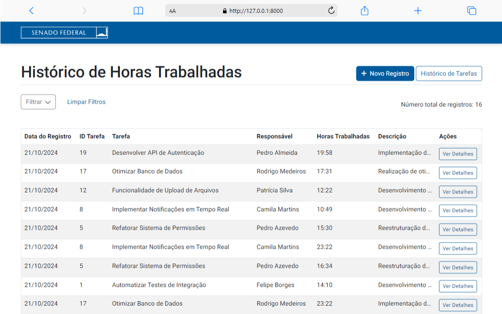

# Sistema de Gerenciamento de Tarefas e Registros de Tempo

Este projeto é um sistema de gerenciamento de tarefas e acompanhamento de horas trabalhadas. Ele permite que usuários criem, visualizem, filtrem e organizem tarefas, bem como registrem as horas trabalhadas em cada tarefa.


## Tabela de Conteúdos

1. [Visão Geral do Projeto](#visão-geral-do-projeto)
2. [Instalação](#instalação)
3. [Tecnologias Utilizadas](#tecnologias-utilizadas)
4. [Funcionalidades Principais](#funcionalidades-principais)
5. [Capturas de Tela](#capturas-de-tela)
6. [Testes e Qualidade de Código](#testes-e-qualidade-de-código)
7. [Contribuição](#contribuição)
8. [Licença](#licença)
9. [Contato](#contato)

## Visão Geral do Projeto

Este sistema foi desenvolvido como parte de um desafio técnico para gestão de tarefas e registros de tempo. Ele oferece uma interface simples e eficiente para acompanhar as tarefas de uma equipe e monitorar o tempo investido em cada uma delas. A aplicação permite a criação de tarefas, registro das horas trabalhadas e visualização detalhada do progresso.

Este projeto foi criado utilizando o framework Django no backend e HTML/CSS/Bootstrap no frontend, proporcionando uma estrutura escalável e eficiente.

## Instalação

### Pré-requisitos:

- Python 3.12 ou superior
- pip (gerenciador de pacotes do Python)
- Git (opcional, mas recomendado)

### Passos para Instalar:

1. Clone o repositório:
   ```bash
   git clone https://github.com/rodrigoMedeiros0/desafio_senado_django.git
   cd desafio_senado_django
2. Crie um ambiente virtual:
    ```bash
    python3 -m venv .venv  # No Windows: python -m venv .venv
    source .venv/bin/activate  # No Windows: .venv\Scripts\activate
3. Instale as dependências:
    ```bash
    pip install -r requirements.txt
4. Realize as migrações do banco de dados:
    ```bash
    python manage.py migrate
5. (Opcional) Crie um superusuário para acessar o admin do Django:
    ```bash
    python manage.py createsuperuser
6. (Opcional) Carregar dados fakes
    ```bash
    python manage.py loaddata dump_db.json
7. Inicie o servidor:
    ```bash
    python manage.py runserver

## Tecnologias Utilizadas

- **Python 3.12**
- **Django 5.1**
- **SQLite** (pode ser substituído por outros bancos de dados como PostgreSQL)
- **HTML5/CSS3**
- **Bootstrap 5** (para layout e responsividade)
- **JavaScript** (para interatividade no frontend)

## Funcionalidades Principais

### Criação e Gerenciamento de Tarefas:
- Adicione tarefas.
- Filtre tarefas por data, título, responsável e descrição

### Registro de Horas Trabalhadas:
- Associe horas trabalhadas a cada tarefa.
- Acompanhe o tempo gasto em cada tarefa individualmente.
- Filtre registros por id da tarefa, título da tarefa, responsável, data, horas trabalhadas e descricão. 

### Administração:
- Painel de administração do Django para gerenciar tarefas e registros de tempo.

### Visualização Detalhada:
- Cada tarefa e registro tem páginas detalhadas para melhorar a visualização e interação entre os dois. 

## Capturas de Tela

 

 

 

 

 

## Testes e Qualidade de Código

### Testes Automatizados

O projeto inclui testes automatizados para garantir que as funcionalidades chave do sistema funcionem corretamente. A estrutura de testes foi implementada utilizando o framework de testes do Django. Para rodar os testes:

    python manage.py test

### Qualidade de Código
Para garantir que o código segue as melhores práticas de desenvolvimento, foi utilizado o Flake8 para análise de código estático. O Flake8 verifica a conformidade do código com os padrões da PEP8, garantindo consistência e qualidade. Para executar a análise estática:
    
    flake8

## Contribuição

Contribuições são bem-vindas! Se você deseja contribuir para este projeto, siga os passos abaixo:

1. Faça um fork do repositório.
2. Crie uma nova branch com sua feature ou correção de bug:
   ```bash
   git checkout -b minha-feature
3. Faça commit de suas mudanças
   ```bash
   git commit -m 'Adiciona minha nova feature'
4. Crie uma nova branch com sua feature ou correção de bug:
   ```bash
   git push origin minha-feature
5. Abra um Pull Request e aguarde a revisão.

## Licença

Este projeto é licenciado sob a Licença MIT. Consulte o arquivo [LICENSE](LICENSE) para obter mais informações.

## Contato

Caso tenha dúvidas ou sugestões, fique à vontade para me contatar:

- **Nome:** Rodrigo Medeiros
- **E-mail:** rodrigovinicius.bsb@gmail.com
- **LinkedIn:** [Rodrigo Medeiros](https://www.linkedin.com/in/rodrigo--medeiros/)
